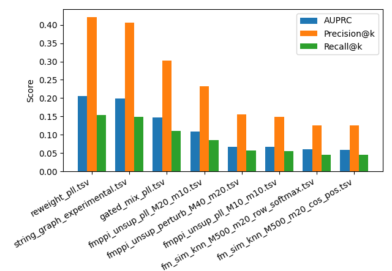

# PLMs in coupling interactome signals

Code for the course project of Stanford CS277 (Winter 2026).

We explored whether PLMs encode sequence-level signals that can recover centered interactome networks. We constructed unsupervised weighted graphs using:

- Pseudo-log-likelihood difference
- Perturbation coupling (Δlog-prob across chimeric sequences)

We found that PLMs signals capture interaction-relevant information, they provide modest gains when used to reweight experimenal PPI graphs.